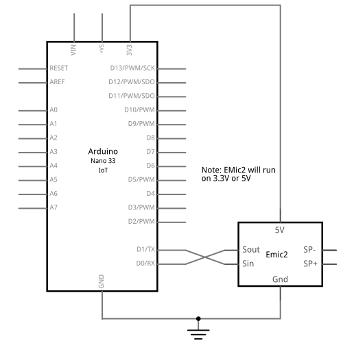
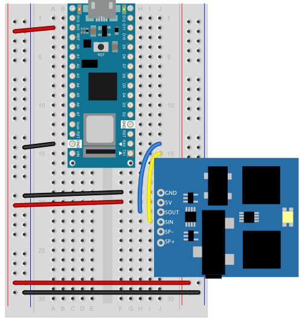

# Emic2 Text-to-Speech Generator

The [Emic2](https://www.parallax.com/product/emic-2-text-to-speech-module/) is a text-to-speech generator with an asynchronous serial interface made by [Parallax](https://www.parallax.com/). Sparkfun and other retailers used to carry it as well. Sadly, it seems to be mostly out of production now. 

 If you're working with an Arduino that has two hardware serial ports, such as any of the SAMD boards (MKR boards, Nano 33 IoT) or the 32U4 boards (Leonardo, Micro), then you can just attach the Emic2. If you're working with an Uno or another board with only one hardware serial port, you'll need the [SoftwareSerial](https://docs.arduino.cc/learn/built-in-libraries/software-serial) library. Paul Stoffregen maintains a [version of it](https://github.com/PaulStoffregen/SoftwareSerial).  

 To connect the Emic2 to any Arduino, the SOUT goes to the Arduino's RX and the SIN goes to the Arduino's TX. Although the Emic2 is rated to run at 5V, it runs fine on 3.3V as well. Figures 1 and 2 below show an Arduino Nano 33 IoT connected to an Emic2.

 

 _Figure 1. Schematic drawing of an Emic2 text-to-speech module connected to an Arduino Nano_

 

 _Figure 2. Breadboard drawing of an Emic2 text-to-speech module connected to an Arduino Nano_
 